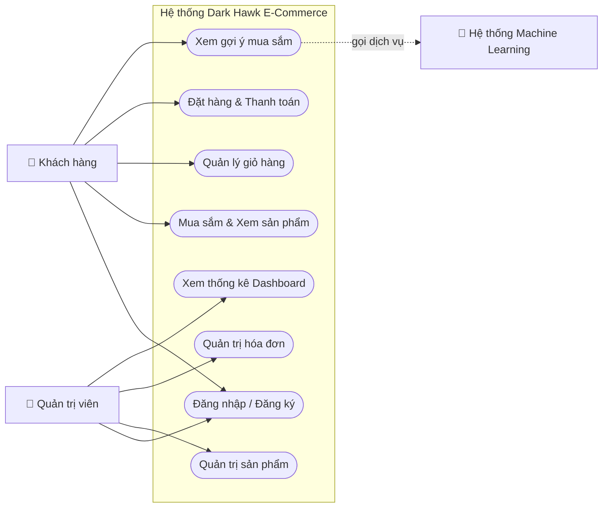
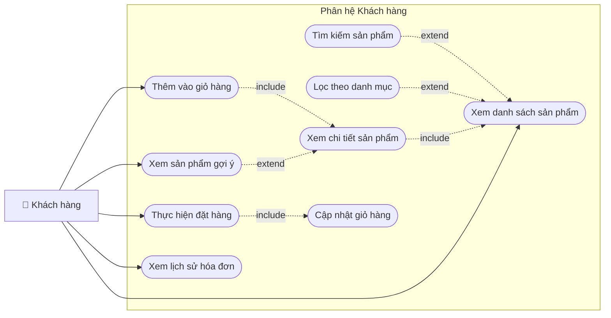
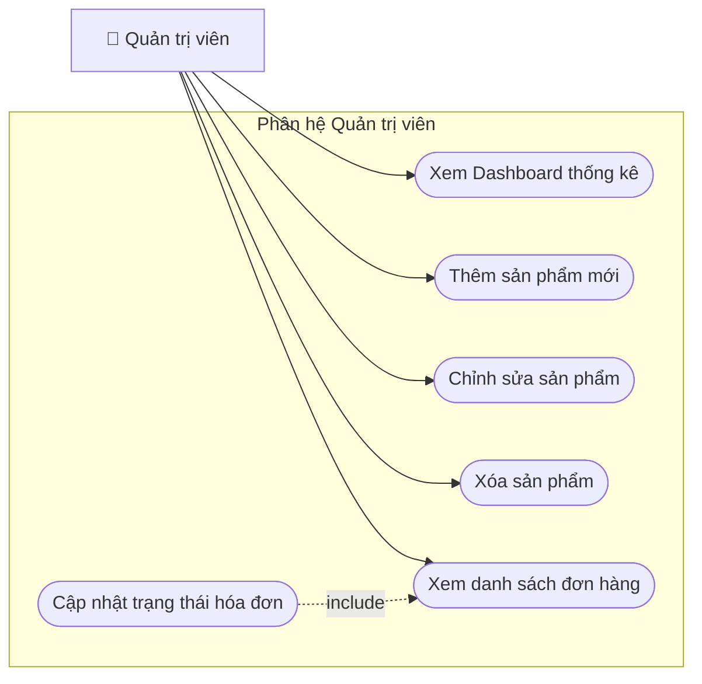
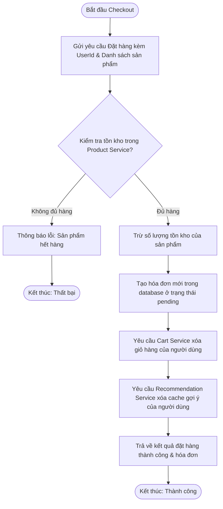
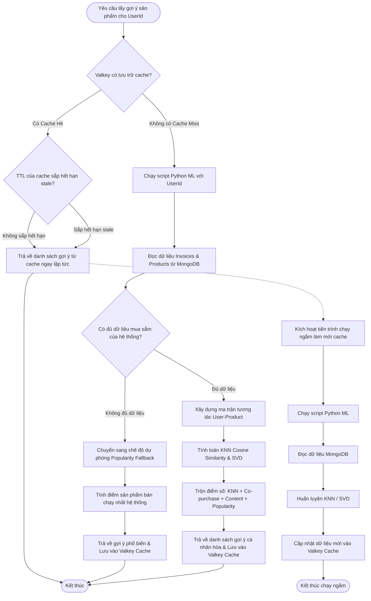
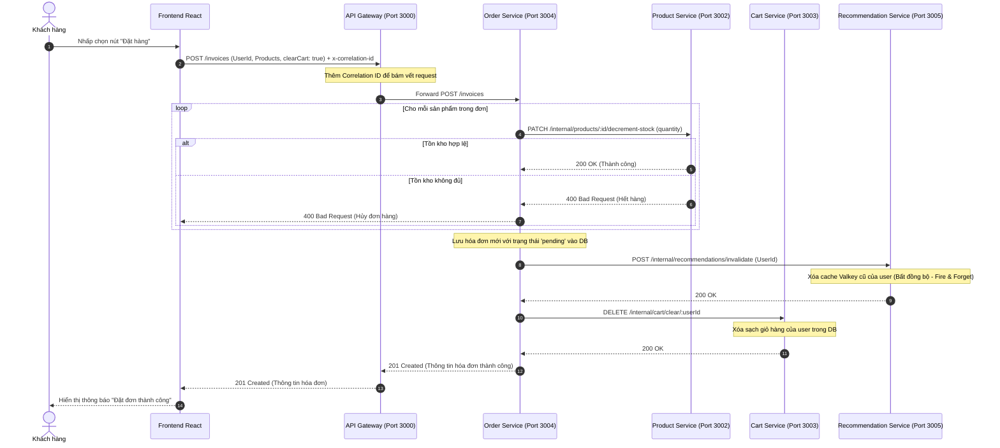
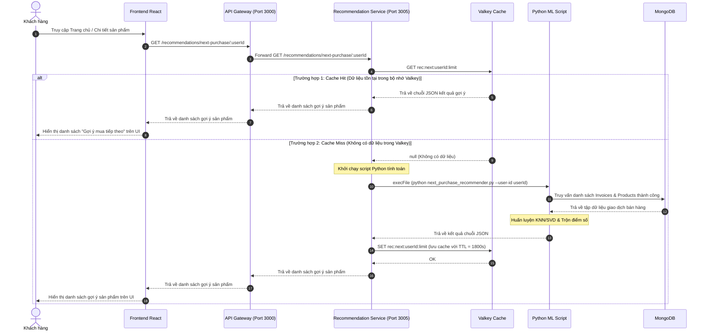
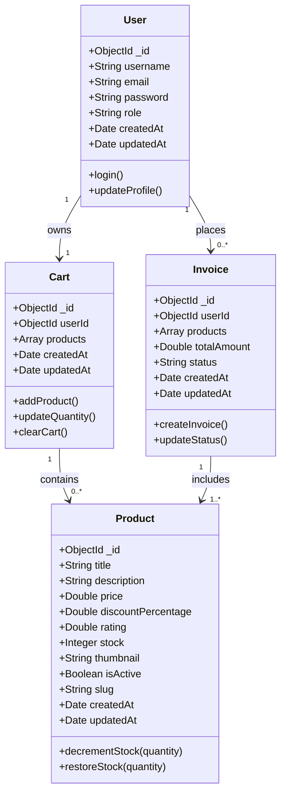
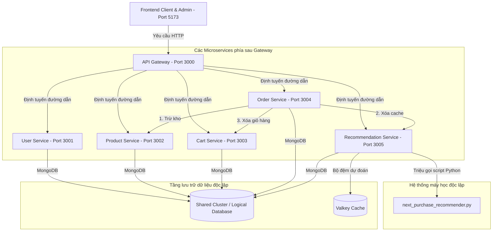

# BÁO CÁO BÀI TẬP LỚN: PHÂN TÍCH THIẾT KẾ HỆ THỐNG
## ĐỀ TÀI: XÂY DỰNG HỆ THỐNG THƯƠNG MẠI ĐIỆN TỬ HƯỚNG DỊCH VỤ (SOA) TÍCH HỢP MACHINE LEARNING - DARK HAWK

---

## MỞ ĐẦU: GIỚI THIỆU THÀNH VIÊN & PHÂN CHIA CÔNG VIỆC

Dự án **Dark Hawk** là một nền tảng thương mại điện tử hiện đại, được thiết kế và phát triển dựa trên kiến trúc hướng dịch vụ (Service-Oriented Architecture - SOA) nhằm giải quyết các bài toán về khả năng mở rộng hệ thống, đồng thời tích hợp mô hình học máy (Machine Learning) để đưa ra dự đoán sản phẩm có khả năng mua tiếp theo (Next Purchase Prediction) nhằm tối ưu hóa trải nghiệm khách hàng và tăng doanh thu.

### 1. Thành viên nhóm và thông tin chung
Nhóm thực hiện dự án gồm các thành viên với sự phân chia vai trò và tỷ lệ đóng góp như sau:

| STT | Họ và Tên | Mã số sinh viên | Vai trò | Nhiệm vụ chính trong dự án | Tỷ lệ đóng góp |
| :--- | :--- | :--- | :--- | :--- | :--- |
| 1 | **Trần Minh Diệu** | *[Mẫu: 2021XXXX]* | Nhóm trưởng / Kiến trúc sư | Thiết kế kiến trúc SOA, thiết kế API Gateway, xây dựng Recommendation Service (Python + Node.js), tích hợp hệ thống. | **40%** |
| 2 | **Nguyễn Văn A** | *[Mẫu: 2021XXXX]* | Lập trình viên Frontend | Phát triển giao diện phía máy khách (Client UI) và trang quản trị (Admin UI) bằng React, quản lý trạng thái bằng Redux Toolkit. | **30%** |
| 3 | **Trần Thị B** | *[Mẫu: 2021XXXX]* | Lập trình viên Backend | Xây dựng các dịch vụ nghiệp vụ (Product, Order, User, Cart Services), thiết kế cơ sở dữ liệu MongoDB và kiểm thử hệ thống. | **30%** |
| **Tổng cộng** | | | | | **100%** |

---

## PHẦN 1: MÔ TẢ BÀI TOÁN & YÊU CẦU HỆ THỐNG

### 1. Phân tích và mô tả yêu cầu

#### A. Yêu cầu người dùng (User Requirements)
Hệ thống cần phục vụ hai nhóm đối tượng người dùng chính với những nhu cầu thực tế sau:
*   **Khách hàng (Client):** Cần một giao diện mua sắm trực tuyến trực quan, tốc độ tải trang nhanh, dễ dàng tìm kiếm và phân loại sản phẩm. Khách hàng mong muốn có giỏ hàng tiện lợi, quy trình thanh toán nhanh chóng, xem lại lịch sử hóa đơn dễ dàng. Đặc biệt, khách hàng cần các gợi ý mua sắm thông minh, mang tính cá nhân hóa cao dựa trên thói quen mua sắm thực tế của mình để tiết kiệm thời gian tìm kiếm.
*   **Quản trị viên (Admin):** Cần một bảng điều khiển tổng quan (Dashboard) cập nhật liên tục về doanh thu, số đơn hàng và sản phẩm bán chạy. Admin có nhu cầu quản lý danh mục sản phẩm (thêm mới, chỉnh sửa thông tin, cập nhật kho hàng), theo dõi và cập nhật trạng thái đơn hàng của khách hàng nhằm vận hành hệ thống hiệu quả.

#### B. Yêu cầu chức năng (Functional Requirements)
Hệ thống được chia làm hai phân hệ chức năng rõ rệt:

##### Phân hệ Khách hàng:
1.  **Xác thực tài khoản (Authentication):** Đăng nhập vào hệ thống để mua sắm và lưu lịch sử đơn hàng.
2.  **Xem danh mục & Chi tiết sản phẩm:** Tìm kiếm sản phẩm bằng từ khóa (Search), lọc theo danh mục (Category), phân trang (Pagination), và xem chi tiết sản phẩm bao gồm hình ảnh, đánh giá, mô tả và số lượng tồn kho.
3.  **Quản lý giỏ hàng (Cart Management):** Thêm sản phẩm vào giỏ hàng, cập nhật số lượng mua, xóa sản phẩm khỏi giỏ hàng hoặc làm trống giỏ hàng.
4.  **Đặt hàng & Thanh toán (Checkout):** Tiến hành tạo đơn hàng (Invoice) từ giỏ hàng hiện tại hoặc mua nhanh ngay lập tức. Sau khi đặt hàng, giỏ hàng sẽ tự động được làm trống và trừ số lượng sản phẩm tương ứng trong kho.
5.  **Xem lịch sử mua hàng:** Theo dõi trạng thái hóa đơn cá nhân (Chờ xử lý - pending, Đã thanh toán - paid, Đã hủy - cancelled).
6.  **Gợi ý mua sắm cá nhân hóa (Recommendation):** Hiển thị danh sách các sản phẩm gợi ý mà khách hàng có khả năng sẽ mua tiếp theo (Next Purchase Prediction) dựa trên lịch sử hóa đơn của chính khách hàng và xu hướng mua sắm của toàn hệ thống.

##### Phân hệ Quản trị viên:
1.  **Thống kê Dashboard:** Xem các chỉ số tổng quan (tổng doanh thu, tổng số sản phẩm, tổng số hóa đơn), biểu đồ doanh số và danh sách hóa đơn mới nhất.
2.  **Quản lý sản phẩm (Product CRUD):** Thêm sản phẩm mới (tự động tạo đường dẫn slug thân thiện), sửa thông tin sản phẩm và xóa sản phẩm khi ngừng kinh doanh.
3.  **Quản lý hóa đơn (Invoice Management):** Xem danh sách tất cả các hóa đơn mua sắm trong hệ thống, cập nhật trạng thái hóa đơn (ví dụ duyệt thanh toán hoặc hủy đơn). Khi hủy đơn hàng ở trạng thái pending, hệ thống phải tự động hoàn lại số lượng tồn kho cho sản phẩm.
4.  **Quản lý người dùng:** Xem danh sách người dùng đã đăng ký tài khoản trên hệ thống.

#### C. Yêu cầu phi chức năng (Non-functional Requirements) - *NỘI DUNG QUAN TRỌNG*
Để đảm bảo hệ thống vận hành ổn định trong môi trường thương mại điện tử thực tế, các yêu cầu phi chức năng sau đã được thiết kế và thực thi nghiêm ngặt:

1.  **Hiệu năng (Performance):**
    *   *Thời gian phản hồi (Latency):* Các API truy vấn thông thường (danh sách sản phẩm, thông tin người dùng) phải phản hồi dưới 100ms. Đối với API dự đoán gợi ý mua hàng (vốn phải xử lý toán học phức tạp thông qua mô hình Python ML), thời gian phản hồi phải dưới 150ms nhờ cơ chế bộ đệm (Caching) Valkey và cơ chế làm mới ngầm (Stale-While-Revalidate).
    *   *Tối ưu hóa Frontend:* Sử dụng kỹ thuật chia mã nguồn (Code Splitting) với `React.lazy` và `Suspense` giúp giảm dung lượng bundle ban đầu khi người dùng truy cập. Áp dụng kỹ thuật trì hoãn tìm kiếm (Debounced Search) tại ô tìm kiếm để hạn chế số lượng request liên tục gửi về backend.
2.  **Khả năng mở rộng (Scalability):**
    *   *Mô hình hướng dịch vụ (SOA):* Việc chia nhỏ hệ thống thành các dịch vụ riêng biệt (User, Product, Cart, Order, Recommendation) cho phép nhân rộng (scale) độc lập các dịch vụ có tải cao. Ví dụ, dịch vụ sản phẩm (`product-service`) có lượng đọc cực kỳ lớn có thể được triển khai nhiều instance mà không ảnh hưởng tới dịch vụ đặt hàng (`order-service`).
    *   *Cơ sở dữ liệu độc lập:* Mỗi dịch vụ sử dụng cơ sở dữ liệu logic riêng để tránh tranh chấp khóa (locking) và tắc nghẽn ở tầng lưu trữ dữ liệu.
3.  **Bảo mật (Security):**
    *   *Bảo vệ định tuyến (Protected Routes):* Hệ thống triển khai các lớp lọc (Middlewares) ở cả Frontend và Backend để ngăn chặn người dùng thường truy cập trái phép vào tài nguyên của Admin.
    *   *Xác thực an toàn:* Quản lý phiên đăng nhập an toàn bằng Cookie và cơ chế mã hóa mật khẩu ở Backend.
    *   *Kiểm soát truy cập (CORS):* Cấu hình CORS chặt chẽ tại API Gateway chỉ cho phép các yêu cầu hợp lệ từ Frontend tương tác.
4.  **Độ tin cậy & Tính sẵn sàng (Reliability & Availability):**
    *   *Cơ chế dự phòng (Fallback):* Khi dịch vụ gợi ý sản phẩm (`recommendation-service`) bị quá tải hoặc mô hình học máy gặp sự cố (hoặc hệ thống chưa có đủ dữ liệu lịch sử giao dịch - bài toán khởi đầu lạnh), hệ thống sẽ tự động chuyển sang cơ chế dự phòng trả về các sản phẩm bán chạy nhất hệ thống (`fallback_popularity`) thay vì gây treo ứng dụng của người dùng.
    *   *Bám vết phân tán (Distributed Tracing):* Mọi yêu cầu đi qua hệ thống đều được đính kèm một mã định danh duy nhất (Correlation ID) thông qua header `x-correlation-id`. Điều này giúp bộ phận vận hành dễ dàng tra cứu log và phát hiện vị trí xảy ra lỗi trong chuỗi dịch vụ.

---

### 2. Thiết kế biểu đồ Use Case (UC)

Hệ thống bao gồm 3 tác nhân (Actors): Khách hàng (Client), Quản trị viên (Admin) và Dịch vụ học máy (ML System - tác nhân hệ thống).

#### A. Biểu đồ Use Case tổng quát hệ thống


#### B. Biểu đồ Use Case chi tiết phân hệ Khách hàng


#### C. Biểu đồ Use Case chi tiết phân hệ Quản trị viên


---

### 3. Đặc tả Use Case chi tiết

Dưới đây là đặc tả chi tiết cho 2 Use Case cốt lõi của hệ thống: **Đặt hàng & Thanh toán** (Checkout) và **Xem gợi ý mua sắm** (Next Purchase Prediction).

#### Đặc tả Use Case: Đặt hàng & Thanh toán (Checkout)

| Mục | Nội dung đặc tả |
| :--- | :--- |
| **Tên Use Case** | Đặt hàng & Thanh toán (Checkout) |
| **Tác nhân** | Khách hàng (Client) |
| **Mục tiêu** | Khách hàng đặt mua thành công các sản phẩm trong giỏ hàng, tạo hóa đơn mới trong hệ thống và cập nhật tồn kho. |
| **Tiền điều kiện** | Khách hàng đã đăng nhập tài khoản và có ít nhất một sản phẩm trong giỏ hàng. |
| **Luồng sự kiện chính (Basic Flow)** | 1. Khách hàng truy cập trang giỏ hàng và nhấn nút "Đặt hàng".<br>2. Hệ thống chuyển thông tin giỏ hàng đến dịch vụ hóa đơn (`order-service`).<br>3. Dịch vụ hóa đơn gửi yêu cầu kiểm tra tồn kho sang dịch vụ sản phẩm (`product-service`).<br>4. Dịch vụ sản phẩm xác nhận hàng còn đủ và trừ số lượng tồn kho tương ứng, phản hồi thành công.<br>5. Dịch vụ hóa đơn tạo bản ghi hóa đơn mới với trạng thái "pending" và tính tổng tiền.<br>6. Dịch vụ hóa đơn gọi dịch vụ giỏ hàng (`cart-service`) để làm trống giỏ hàng của người dùng.<br>7. Dịch vụ hóa đơn gọi dịch vụ khuyến nghị (`recommendation-service`) để xóa bộ đệm gợi ý cũ của người dùng này (vì lịch sử mua hàng đã thay đổi).<br>8. Hệ thống thông báo đặt hàng thành công và hiển thị hóa đơn vừa tạo. |
| **Luồng thay thế (Alternative Flow)** | *Tại bước 1:* Khách hàng nhấn "Mua ngay" tại trang chi tiết sản phẩm. Hệ thống bỏ qua bước giỏ hàng, chuyển thẳng thông tin sản phẩm đó đến dịch vụ hóa đơn để thực hiện đặt hàng trực tiếp mà không cần xóa giỏ hàng ở bước 6. |
| **Luồng ngoại lệ (Exception Flow)** | *Tại bước 4:* Nếu một trong các sản phẩm trong giỏ hàng đã hết hoặc không đủ số lượng tồn kho:<br>- Dịch vụ sản phẩm trả về lỗi và hoàn tác các thay đổi tồn kho (nếu có).<br>- Dịch vụ hóa đơn hủy quy trình tạo hóa đơn.<br>- Hệ thống thông báo lỗi chi tiết về sản phẩm không đủ hàng để người dùng cập nhật lại số lượng. |
| **Hậu điều kiện** | Hóa đơn mới được lưu lại; giỏ hàng bị xóa sạch (nếu đặt từ giỏ); tồn kho sản phẩm được cập nhật chính xác; bộ đệm gợi ý của người dùng được xóa để sẵn sàng cập nhật theo thói quen mua sắm mới. |

#### Đặc tả Use Case: Gợi ý sản phẩm tiếp theo (Next Purchase Prediction)

| Mục | Nội dung đặc tả |
| :--- | :--- |
| **Tên Use Case** | Xem gợi ý mua sắm (Next Purchase Prediction) |
| **Tác nhân** | Khách hàng (Client), Hệ thống ML (tác nhân hỗ trợ) |
| **Mục tiêu** | Hệ thống hiển thị danh sách các sản phẩm mà khách hàng có khả năng cao sẽ mua tiếp theo dựa trên phân tích lịch sử hành vi mua sắm. |
| **Tiền điều kiện** | Khách hàng truy cập trang chủ hoặc trang chi tiết sản phẩm. |
| **Luồng sự kiện chính (Basic Flow)** | 1. Trình duyệt gửi yêu cầu lấy sản phẩm gợi ý của khách hàng đến API Gateway.<br>2. API Gateway định tuyến yêu cầu đến dịch vụ gợi ý (`recommendation-service`).<br>3. Dịch vụ gợi ý kiểm tra bộ đệm Valkey để tìm kết quả gợi ý đã lưu trước đó của người dùng.<br>4. Hệ thống phát hiện có dữ liệu trong cache (Cache Hit) và thời hạn lưu trữ vẫn còn hiệu lực.<br>5. Dịch vụ gợi ý trả ngay kết quả trong cache về cho khách hàng (thời gian phản hồi cực nhanh). |
| **Luồng thay thế (Alternative Flow)** | *Trường hợp Cache Miss hoặc dữ liệu trong cache gần hết hạn (Stale-While-Revalidate):*<br>1. Dịch vụ gợi ý khởi chạy một tiến trình con gọi kịch bản Python Machine Learning (`next_purchase_recommender.py`).<br>2. Script Python kết nối tới MongoDB, thu thập toàn bộ dữ liệu lịch sử hóa đơn của các khách hàng và danh mục sản phẩm hiện có.<br>3. Script Python xây dựng ma trận tương tác người dùng - sản phẩm, áp dụng thuật toán lọc cộng tác KNN (Cosine Similarity) hoặc phân tích giá trị kỳ dị (SVD) để tính điểm số gợi ý.<br>4. Script trộn điểm mô hình với độ phổ biến toàn cục để tối ưu và trả về chuỗi JSON kết quả.<br>5. Dịch vụ gợi ý lưu kết quả này vào Valkey Cache và trả về giao diện người dùng. |
| **Luồng ngoại lệ (Exception Flow)** | *Trường hợp khách hàng mới chưa mua gì (Cold Start) hoặc script Python gặp lỗi kết nối/tài nguyên:*<br>- Script Python/Dịch vụ gợi ý tự động phát hiện tình huống và kích hoạt cơ chế dự phòng (`fallback_popularity`).<br>- Hệ thống tính toán độ phổ biến toàn cục của sản phẩm dựa trên số lượng bán chạy của tất cả hóa đơn thành công trước đó.<br>- Trả về danh sách sản phẩm bán chạy nhất cho khách hàng để đảm bảo giao diện vẫn hiển thị nội dung gợi ý hữu ích. |
| **Hậu điều kiện** | Khách hàng nhận được danh sách gợi ý cá nhân hóa; kết quả gợi ý mới được ghi nhận vào bộ nhớ đệm phục vụ cho các lượt truy cập tiếp theo. |

#### Đặc tả Use Case: Quản lý sản phẩm (Product CRUD - Admin)

| Mục | Nội dung đặc tả |
| :--- | :--- |
| **Tên Use Case** | Quản lý sản phẩm (Product CRUD) |
| **Tác nhân** | Quản trị viên (Admin) |
| **Mục tiêu** | Admin thêm mới, chỉnh sửa thông tin hoặc xóa sản phẩm trong hệ thống thành công. |
| **Tiền điều kiện** | Admin đã đăng nhập thành công và có quyền truy cập trang Admin Dashboard. |
| **Luồng sự kiện chính (Basic Flow) - Thêm sản phẩm mới** | 1. Admin truy cập trang "Quản lý sản phẩm" trên trang quản trị.<br>2. Hệ thống tải danh sách sản phẩm hiện có từ dịch vụ sản phẩm (`product-service`) và hiển thị lên bảng.<br>3. Admin nhấn nút "Thêm sản phẩm mới".<br>4. Hệ thống hiển thị biểu mẫu (Form) nhập liệu.<br>5. Admin nhập đầy đủ thông tin (Tên sản phẩm, mô tả, đơn giá, phần trăm giảm giá, số lượng kho, ảnh thumbnail).<br>6. Hệ thống tự động kích hoạt hàm tạo đường dẫn `slug` thân thiện dựa trên tên sản phẩm.<br>7. Admin xác nhận lưu sản phẩm.<br>8. Hệ thống gửi dữ liệu đến dịch vụ sản phẩm. Dịch vụ sản phẩm kiểm tra tính hợp lệ, lưu vào MongoDB và phản hồi thành công.<br>9. Hệ thống cập nhật danh sách và thông báo thêm sản phẩm thành công. |
| **Luồng thay thế (Alternative Flow) - Sửa & Xóa sản phẩm** | *Kịch bản chỉnh sửa sản phẩm:*<br>1. Tại bảng danh sách, Admin nhấn nút "Sửa" ở sản phẩm tương ứng.<br>2. Hệ thống hiển thị Form chứa dữ liệu hiện tại.<br>3. Admin chỉnh sửa các trường thông tin và nhấn "Cập nhật". Dịch vụ sản phẩm cập nhật bản ghi trong DB và trả về kết quả thành công.<br><br>*Kịch bản xóa sản phẩm:*<br>1. Admin nhấn nút "Xóa" ở sản phẩm mong muốn.<br>2. Hệ thống hiển thị hộp thoại cảnh báo xác nhận xóa.<br>3. Admin nhấn xác nhận. Dịch vụ sản phẩm xóa sản phẩm hoặc đánh dấu `isActive = false` trong DB, phản hồi thành công. |
| **Luồng ngoại lệ (Exception Flow)** | *Tại bước 5:* Admin bỏ trống các trường bắt buộc hoặc nhập sai kiểu dữ liệu (ví dụ giá tiền âm hoặc kho hàng chữ cái):<br>- Hệ thống hiển thị thông báo lỗi ngay trên Form (Client-side validation) và khóa nút Lưu.<br>*Tại bước 8:* Gặp lỗi trùng lặp `slug` trong database:<br>- Dịch vụ sản phẩm trả về lỗi mã 400 (Duplicate Key).<br>- Hệ thống hiển thị thông báo lỗi "Tên sản phẩm đã tồn tại" để Admin thay đổi. |
| **Hậu điều kiện** | Thông tin sản phẩm mới hoặc thay đổi được ghi nhận thành công trong cơ sở dữ liệu MongoDB; giao diện hiển thị cho cả Admin và Khách hàng được cập nhật tương ứng. |

---

### 4. Trình bày về công nghệ sử dụng

Hệ thống được phát triển dựa trên các công nghệ hiện đại, phân tách rõ ràng trách nhiệm của từng tầng cấu trúc:

*   **Frontend (Tầng giao diện):**
    *   **React 19:** Thư viện xây dựng giao diện người dùng dựa trên thành phần (Components). React 19 cung cấp khả năng tối ưu hóa việc render và cải thiện hiệu năng.
    *   **TypeScript:** Đảm bảo an toàn kiểu dữ liệu (Type-safety), hạn chế lỗi run-time và tăng tốc độ phát triển nhờ cơ chế tự động gợi ý code (IntelliSense).
    *   **Redux Toolkit:** Thư viện quản lý trạng thái tập trung (State Management) cho các thông tin dùng chung trên toàn hệ thống như thông tin tài khoản đăng nhập (`UserReducer`) và giỏ hàng (`CartReducer`).
    *   **TailwindCSS 4:** Framework CSS tiện ích (Utility-first) giúp xây dựng giao diện tối giản, hiện đại (dark theme) với khả năng tùy biến cao và hỗ trợ Responsive tốt cho mọi kích thước màn hình.
    *   **Vite:** Công cụ xây dựng dự án (Build tool) thế hệ mới, cho phép Hot Module Replacement (HMR) cực nhanh trong môi trường phát triển và tối ưu hóa đóng gói production bundle.
    *   **Axios:** Thư viện gửi yêu cầu HTTP Client kết nối tới API Gateway của Backend.
*   **Backend & Services (Tầng dịch vụ):**
    *   **Node.js & Express:** Nền tảng run-time và framework gọn nhẹ, hiệu năng cao để xây dựng các API RESTful cho các dịch vụ.
    *   **http-proxy-middleware:** Sử dụng để xây dựng API Gateway định tuyến động tất cả các yêu cầu từ Frontend tới đúng các dịch vụ xử lý tương ứng phía sau.
*   **Database & Caching (Tầng lưu trữ dữ liệu):**
    *   **MongoDB & Mongoose:** Hệ quản trị cơ sở dữ liệu NoSQL định dạng tài liệu (Document) linh hoạt, phù hợp cho hệ thống thương mại điện tử với cấu trúc sản phẩm và hóa đơn thường xuyên cập nhật. Mongoose giúp định nghĩa các Schema chặt chẽ cho dữ liệu.
    *   **Valkey:** Bộ nhớ đệm lưu trữ dữ liệu phân tán (In-memory Database), đóng vai trò cực kỳ quan trọng trong việc lưu trữ tạm thời kết quả gợi ý sản phẩm của từng người dùng, giảm tải tối đa cho tầng tính toán Machine Learning.
*   **Machine Learning (Tầng trí tuệ nhân tạo):**
    *   **Python 3:** Ngôn ngữ hàng đầu cho phân tích dữ liệu và học máy.
    *   **scikit-learn:** Thư viện máy học dùng để triển khai mô hình Collaborative Filtering dựa trên thuật toán **K-Nearest Neighbors (KNN)** tính khoảng cách Cosine giữa các vector hành vi mua sắm của người dùng, kết hợp phương pháp phân tích ma trận **TruncatedSVD** để tối ưu dự báo.
    *   **pandas & pymongo:** pandas dùng để xử lý dữ liệu ma trận, trích xuất đặc trưng hành vi người dùng; pymongo kết nối trực tiếp đến database MongoDB để nạp dữ liệu hóa đơn thời gian thực phục vụ huấn luyện mô hình.

---

## PHẦN 2: PHÂN TÍCH THIẾT KẾ HỆ THỐNG

### 1. Phân tích thiết kế chức năng (Biểu đồ UML)

#### A. Biểu đồ Activity (Activity Diagram)

##### Luồng chức năng "Đặt hàng và Thanh toán" (Checkout)
Biểu đồ mô tả hoạt động nghiệp vụ từ khi khách hàng bắt đầu click đặt hàng trong giỏ hàng đến khi hoàn tất đơn hàng và cập nhật hệ thống.



##### Luồng chức năng "Huấn luyện và Dự đoán gợi ý sản phẩm"
Biểu đồ mô tả cách thức hệ thống tiếp nhận yêu cầu gợi ý, khai thác bộ đệm Valkey và triệu gọi script Python để huấn luyện/dự báo hành vi mua tiếp theo.



---

#### B. Biểu đồ Sequence (Sequence Diagram)

##### Luồng Đặt hàng (Checkout Flow) giữa các microservices
Biểu đồ mô tả sự tương tác tuần tự giữa các dịch vụ trong hệ thống thông qua API Gateway khi khách hàng thực hiện checkout giỏ hàng.



##### Luồng lấy Gợi ý sản phẩm (Recommendation Flow)
Biểu đồ thể hiện cách thức lấy danh sách khuyến nghị của người dùng từ phía khách hàng thông qua API Gateway, Valkey Cache, và script Python Machine Learning.



##### C. Biểu đồ lớp (Class Diagram)
Biểu đồ mô tả cấu trúc tĩnh của các thực thể dữ liệu chính trong hệ thống (User, Product, Cart, Invoice) và mối quan hệ giữa chúng.



---

### 2. Thiết kế mô hình hướng dịch vụ (Service-Oriented Design) - *NỘI DUNG QUAN TRỌNG*

#### A. Làm rõ các vấn đề của kiến trúc Monolith (Đơn khối)
Trong các hệ thống thương mại điện tử truyền thống viết theo kiểu Monolith, toàn bộ mã nguồn bao gồm quản lý người dùng, quản lý sản phẩm, giỏ hàng, hóa đơn và cả các logic gợi ý thông minh đều được đóng gói và chạy chung trong một tiến trình máy chủ (Process) duy nhất sử dụng chung một cơ sở dữ liệu. Thiết kế này gặp phải các vấn đề nghiêm trọng sau:

1.  **Nghẽn cổ chai tài nguyên (Resource Contention & Database Bottleneck):** Tính năng gợi ý sản phẩm (Next Purchase Prediction) sử dụng các mô hình Machine Learning đòi hỏi CPU và RAM cực kỳ lớn để tải toàn bộ lịch sử mua sắm và nhân các ma trận đặc trưng lớn. Khi hệ thống Monolith chạy huấn luyện mô hình này, nó sẽ chiếm dụng toàn bộ tài nguyên hệ thống, làm chậm hoặc tê liệt hoàn toàn chức năng đặt hàng và thanh toán vốn yêu cầu thời gian phản hồi tức thì.
2.  **Khó khăn trong việc mở rộng (Scale):** Trong thương mại điện tử, tần suất đọc danh sách sản phẩm và xem chi tiết sản phẩm cao gấp hàng trăm lần tần suất đặt hàng hay cập nhật thông tin người dùng. Với Monolith, nếu muốn tăng khả năng tải của trang sản phẩm, bắt buộc phải scale toàn bộ hệ thống (kèm theo cả các module nặng nề khác), gây lãng phí tài nguyên máy chủ vô cùng lớn.
3.  **Khóa chết công nghệ (Technology Lock-in):** Một dự án Monolith viết bằng Node.js rất khó tích hợp trực tiếp các thư viện khoa học dữ liệu mạnh mẽ của Python (như scikit-learn, pandas, numpy). Việc triển khai thuật toán ML trên JavaScript/TypeScript vừa chậm vừa thiếu thư viện hỗ trợ chuyên sâu.
4.  **Rủi ro lỗi lan chuyền (Single Point of Failure):** Chỉ cần một lỗi nhỏ gây tràn bộ nhớ (Memory Leak) trong module gợi ý sản phẩm hoặc module báo cáo thống kê sẽ kéo sập toàn bộ máy chủ, khiến khách hàng không thể đăng nhập, duyệt sản phẩm hay thanh toán tiền, gây tổn thất lớn về mặt kinh tế.

---

#### B. Thiết kế theo hướng dịch vụ thế nào để giải quyết vấn đề?
Để khắc phục hoàn toàn các điểm yếu của Monolith, hệ thống Dark Hawk được thiết kế theo hướng dịch vụ (SOA) bằng cách chia nhỏ thành các dịch vụ độc lập, chuyên biệt. Mỗi dịch vụ chạy trên các port khác nhau và có thể triển khai trên các máy chủ vật lý khác nhau:



Với cấu trúc thiết kế này:
*   Mọi yêu cầu từ ngoài đều đi qua **API Gateway**. Gateway sẽ chịu trách nhiệm phân tích đường dẫn và chuyển tiếp đến các service đích thích hợp.
*   **Recommendation Service (Dịch vụ gợi ý):** Chạy tách biệt trên cổng `3005`. Khi cần dự đoán, dịch vụ này sẽ triệu gọi tiến trình Python một cách độc lập. Sự tiêu hao tài nguyên CPU/RAM khi huấn luyện mô hình ML chỉ giới hạn trong phạm vi dịch vụ này, hoàn toàn không ảnh hưởng tới luồng đặt hàng ở cổng `3004` hay xem sản phẩm ở cổng `3002`.
*   Tận dụng sức mạnh đa ngôn ngữ: Hệ thống backend viết chủ yếu bằng **TypeScript/Node.js** cho tốc độ xử lý I/O nhanh, nhưng module máy học được viết bằng **Python** để tận dụng tối đa hệ sinh thái scikit-learn/pandas phong phú.

---

#### C. Các Design Pattern hướng dịch vụ được áp dụng

##### 1. API Gateway Pattern
API Gateway đóng vai trò là điểm đầu vào duy nhất cho mọi request từ Client. Trong dự án Dark Hawk, nó được phát triển bằng Express và `http-proxy-middleware`:
*   *Định tuyến động:* Nhận diện đường dẫn để chuyển tiếp yêu cầu: `/login` và `/profile` hướng tới `user-service`; `/products` hướng tới `product-service`; `/cart` hướng tới `cart-service`; `/invoices` hướng tới `order-service`; và `/recommendations` hướng tới `recommendation-service`.
*   *Che giấu cấu trúc mạng:* Frontend chỉ kết nối tới địa chỉ duy nhất `http://localhost:3000`. Phía sau đó, các microservices chạy trên các port nội bộ (`3001` - `3005`) được che giấu hoàn toàn để nâng cao bảo mật.

##### 2. Database per Service (Logical database splitting)
Dữ liệu của dịch vụ nào sẽ do dịch vụ đó toàn quyền sở hữu thông qua các Schema Mongoose tương ứng:
*   `product-service` sở hữu model `Product` và bộ dữ liệu catalog.
*   `order-service` sở hữu model `Invoice` và quản lý logic thanh toán.
*   Khi `order-service` cần kiểm tra thông tin sản phẩm và trừ kho, nó không được phép kết nối trực tiếp vào collection `products` mà phải gửi yêu cầu HTTP nội bộ (qua Axios) tới dịch vụ sản phẩm:
    `PATCH http://localhost:3002/internal/products/:id/decrement-stock`.
    Điều này giúp bảo toàn tính đóng gói dữ liệu của từng dịch vụ, dễ dàng nâng cấp cấu trúc bảng mà không làm ảnh hưởng tới dịch vụ khác.

##### 3. Distributed Tracing (Correlation ID)
Để theo vết một request đi qua nhiều dịch vụ trong hệ thống phân tán, API Gateway sử dụng middleware tạo ra một Correlation ID (sử dụng thư viện `uuid` tạo mã định danh duy nhất) và gán vào header `x-correlation-id`:
```typescript
app.use((req, res, next) => {
   const correlationId = (req.headers["x-correlation-id"] as string) || uuidv4();
   req.headers["x-correlation-id"] = correlationId;
   res.setHeader("x-correlation-id", correlationId);
   next();
});
```
Mã này được các HTTP Client (Axios) chuyển tiếp sang các dịch vụ tiếp theo. Khi ghi log (logging), các dịch vụ sẽ in kèm mã này, ví dụ:
`[Product Service] PATCH /internal/products/... [correlationId: 3d8b2c...]`
Giúp lập trình viên dễ dàng theo dõi toàn bộ hành trình xử lý của một lượt click đặt hàng đi qua Gateway -> Order Service -> Product Service -> Cart Service -> Recommendation Service.

##### 4. Cache-Aside & Stale-While-Revalidate Patterns (Tối ưu hóa hiệu năng gợi ý)
Recommendation Service áp dụng hai mẫu thiết kế quản lý bộ đệm tiên tiến với Valkey nhằm mang lại trải nghiệm phản hồi ngay tức thì cho người dùng:
*   **Cache-Aside Pattern:** Khi có yêu cầu lấy gợi ý sản phẩm, dịch vụ kiểm tra Valkey trước. Nếu có (Cache Hit), trả về ngay. Nếu không có (Cache Miss), nó kích hoạt script Python chạy dự báo, lưu kết quả nhận được vào Valkey để dùng cho các yêu cầu sau rồi mới phản hồi người dùng.
*   **Stale-While-Revalidate Pattern:** Đây là điểm nhấn quan trọng giúp tối ưu hóa hiệu năng. Bộ đệm Valkey được thiết lập thời gian sống `CACHE_TTL_SECONDS = 1800` (30 phút). Tuy nhiên, một ngưỡng "stale" được định nghĩa tại `STALE_THRESHOLD` (bằng 25% của TTL, tương đương 7.5 phút còn lại). 
    *   Nếu người dùng yêu cầu gợi ý và bộ đệm còn hiệu lực nhưng thời gian còn lại (TTL) nhỏ hơn 7.5 phút, hệ thống nhận định dữ liệu này đã cũ (stale).
    *   Hệ thống lập tức trả về dữ liệu cũ này cho khách hàng ngay (thời gian phản hồi chỉ dưới 5ms), đảm bảo trải nghiệm khách hàng cực kỳ mượt mà.
    *   Đồng thời, hệ thống tự động kích hoạt một luồng xử lý bất đồng bộ chạy ngầm (fire-and-forget) để chạy lại script Python cập nhật dữ liệu mới ghi đè vào cache Valkey.
```typescript
if (ttlRemaining >= 0 && ttlRemaining < STALE_THRESHOLD) {
   // Khởi chạy làm mới dữ liệu ngầm bất đồng bộ mà không bắt client phải chờ đợi
   triggerBackgroundRefresh(options, cache, key);
}
```

##### 5. Fallback Pattern (Nâng cao tính sẵn sàng)
Script Python được thiết kế để tự động kích hoạt cơ chế dự phòng `fallback_popularity` nếu dữ liệu mua sắm của toàn hệ thống quá nhỏ (dưới 2 giao dịch mua sắm thành công) hoặc khi xảy ra lỗi kết nối cơ sở dữ liệu.
Thay vì ném ra lỗi hệ thống (gây treo UI của khách hàng), hệ thống sẽ nhanh chóng tính toán điểm phổ biến của sản phẩm bán chạy nhất hệ thống dựa trên các hóa đơn sẵn có và trả về. Điều này đảm bảo tính sẵn sàng (Availability) tối đa cho dịch vụ.

---

## PHẦN 3: KẾT QUẢ TRIỂN KHAI & ĐÁNH GIÁ

### 1. Giao diện các chức năng

Hệ thống được thiết kế với giao diện Dark Theme hiện đại, sử dụng TailwindCSS 4 mang lại cảm giác cao cấp và chuyên nghiệp.

#### A. Trang chủ Khách hàng (Home Page)
*   **Mô tả:** Hiển thị biểu ngữ giới thiệu (Banner) và danh sách tất cả các sản phẩm đang kinh doanh dưới dạng thẻ lưới (Grid Card). Mỗi thẻ sản phẩm hiển thị ảnh đại diện sắc nét, tên sản phẩm, đánh giá sao, giá gốc, tỷ lệ giảm giá, và thẻ hiển thị giá sau giảm.
*   **Thanh công cụ lọc:** Tích hợp bộ lọc nhanh theo danh mục (như điện thoại, máy tính, phụ kiện) và ô tìm kiếm sản phẩm. Chức năng tìm kiếm áp dụng debounce giúp lọc kết quả tức thì ngay khi người dùng gõ phím mà không cần tải lại trang.
*   **Phân trang:** Phía dưới trang hiển thị thanh điều hướng phân trang mượt mà để quản lý danh sách sản phẩm lớn.

#### B. Trang Chi tiết sản phẩm & Phần Gợi ý cá nhân hóa (Product Detail & Recommendations)
*   **Mô tả:** Hiển thị hình ảnh phóng to của sản phẩm, thông số chi tiết, mô tả sản phẩm và số lượng tồn kho thực tế. Nút "Thêm vào giỏ hàng" và "Mua ngay" được thiết kế nổi bật.
*   **Phân khu gợi ý (Recommendation Section):** Ngay phía dưới thông tin chi tiết sản phẩm là phân khu **"Sản phẩm bạn có thể muốn mua tiếp theo" (Next Purchase Suggestions)**. Phân khu này hiển thị danh sách các sản phẩm gợi ý do `recommendation-service` xử lý riêng cho người dùng đó. Giao diện hiển thị rõ điểm số điểm tin cậy dự báo (ví dụ 85% khả năng mua) giúp tăng tỷ lệ nhấp chuột đặt hàng của người tiêu dùng.

#### C. Trang Giỏ hàng & Thanh toán (Cart & Checkout)
*   **Mô tả:** Danh sách các sản phẩm khách hàng đã chọn mua, hiển thị ảnh thu nhỏ, đơn giá, ô thay đổi số lượng trực tiếp và tổng tiền của từng dòng sản phẩm.
*   **Quy trình thanh toán:** Khi nhấn nút "Đặt hàng", hệ thống sẽ hiển thị một vòng xoay loading ngắn trong khi API Gateway điều phối trừ kho sản phẩm và tạo hóa đơn. Sau khi thành công, hệ thống hiển thị thông báo chúc mừng đặt hàng thành công và chuyển hướng người dùng đến danh sách hóa đơn cá nhân.

#### D. Trang Dashboard Quản trị viên (Admin Dashboard)
*   **Mô tả:** Thiết kế theo phong cách trang quản trị cao cấp.
    *   *Số liệu tổng quan:* Hiển thị 3 thẻ lớn thống kê: Tổng số sản phẩm đang bán, Tổng số hóa đơn đã phát sinh, và Tổng doanh thu (được format sang đơn vị tiền tệ đẹp mắt).
    *   *Báo cáo sản phẩm bán chạy:* Danh sách top sản phẩm có số lượng bán ra nhiều nhất hệ thống.
    *   *Quản lý danh sách hóa đơn:* Hiển thị chi tiết danh sách đơn hàng của tất cả khách hàng cùng nút thay đổi trạng thái nhanh (Duyệt thanh toán / Hủy đơn hàng).

#### E. Trang Quản lý sản phẩm của Admin (Product Management)
*   **Mô tả:** Hiển thị danh sách sản phẩm dưới dạng bảng (Table) chi tiết với các cột: Ảnh, Tên sản phẩm, Giá, Kho hàng và các nút hành động "Sửa", "Xóa".
*   **Biểu mẫu thêm/sửa sản phẩm:** Tích hợp bộ tạo đường dẫn slug tự động dựa trên tên sản phẩm khi Admin nhập liệu (ví dụ: gõ "Điện thoại iPhone 15 Pro" sẽ tự động tạo slug "dien-thoai-iphone-15-pro").

---

### 2. Mô tả kết quả đạt được

Hệ thống đã được kiểm thử và triển khai chạy ổn định cục bộ với đầy đủ 6 dịch vụ hoạt động đồng bộ:

1.  **Chạy dịch vụ phân tán:** Toàn bộ hệ thống khởi động hoàn hảo thông qua tệp tin kịch bản `start-all.bat`. API Gateway tiếp nhận các request trên cổng `3000` và chuyển hướng chính xác đến các dịch vụ con từ `3001` đến `3005`.
2.  **Độ tin cậy của luồng nghiệp vụ:** Luồng trừ tồn kho và hoàn trả kho hoạt động chính xác. Khi một hóa đơn ở trạng thái pending bị hủy bởi admin, số lượng sản phẩm lập tức được khôi phục về kho của `product-service`.
3.  **Hiệu năng vượt trội nhờ Caching:** 
    *   Lần đầu truy cập của một người dùng mới (Cache Miss): Recommendation Service mất khoảng **150ms - 300ms** để khởi chạy Python, đọc DB và huấn luyện mô hình.
    *   Các lần truy cập tiếp theo (Cache Hit): Thời gian phản hồi API gợi ý sản phẩm giảm xuống chỉ còn từ **3ms - 8ms** do dữ liệu được trả về trực tiếp từ Valkey Cache.
    *   Khi người dùng tiến hành mua sắm đơn hàng mới, cache khuyến nghị cũ lập tức được làm trống để đảm bảo gợi ý của lần truy cập sau phản ánh đúng nhu cầu mua sắm mới nhất.

---

### 3. Đánh giá hệ thống

#### A. Ưu điểm
*   **Kiến trúc hướng dịch vụ mạnh mẽ:** Phân chia rõ ràng trách nhiệm của từng module. Hệ thống có độ khớp nối lỏng (Loose coupling) cao, giúp dễ dàng bảo trì và phát triển tính năng mới mà không sợ ảnh hưởng đến các phần khác.
*   **Tích hợp Machine Learning thực tế:** Mô hình học máy không chỉ mang tính lý thuyết mà được tích hợp trực tiếp vào luồng nghiệp vụ mua sắm của khách hàng, hoạt động theo thời gian thực (real-time prediction) dựa trên dữ liệu MongoDB Atlas.
*   **Tối ưu hóa trải nghiệm người dùng:** Giao diện tối giản hiện đại (Dark Theme), tốc độ tải trang nhanh nhờ code splitting và debouncing. Sử dụng Valkey Cache kết hợp stale-while-revalidate giải quyết triệt để vấn đề thời gian chờ (latency) khi chạy các thuật toán trí tuệ nhân tạo nặng nề.
*   **Hệ thống bám vết tốt:** Việc triển khai Correlation ID và cơ chế ghi log phân tán giúp đội ngũ phát triển dễ dàng khoanh vùng và xử lý lỗi khi vận hành hệ thống thực tế.

#### B. Hạn chế
*   **Độ trễ khi khởi chạy nguội (Cold Start):** Với các lần huấn luyện mô hình máy học đầu tiên khi không có cache, việc khởi chạy tiến trình con Python (`execFile`) tốn tài nguyên đĩa I/O và tạo ra một độ trễ nhỏ đối với luồng xử lý của Node.js.
*   **Ràng buộc giao dịch phân tán (Distributed Transactions):** Do mỗi dịch vụ sử dụng cơ sở dữ liệu và quản lý trạng thái riêng, việc đảm bảo tính nhất quán dữ liệu (ví dụ: tạo hóa đơn thành công nhưng dọn dẹp giỏ hàng thất bại do mạng gián đoạn) đòi hỏi cơ chế bù giao dịch phức tạp chưa được triển khai hoàn chỉnh.

#### C. Hướng phát triển tiếp theo
*   **Nâng cấp giao tiếp giữa các dịch vụ:** Thay thế cơ chế gọi API HTTP đồng bộ (REST) giữa các dịch vụ bằng cơ chế giao tiếp bất đồng bộ dựa trên thông điệp (Message Broker như RabbitMQ hoặc Apache Kafka). Điều này giúp luồng đặt hàng hoạt động ổn định hơn nữa ngay cả khi một số dịch vụ con gặp sự cố tạm thời.
*   **Cải tiến dịch vụ Machine Learning:** Thay vì gọi script Python qua tiến trình con (`execFile`), chuyển đổi kịch bản Python thành một dịch vụ web độc lập (ví dụ sử dụng FastAPI) chạy liên tục. Điều này giúp loại bỏ hoàn toàn độ trễ khởi chạy tiến trình Python và cho phép scale riêng tầng học máy một cách dễ dàng hơn.
*   **Áp dụng Saga Pattern:** Thiết kế các luồng giao dịch phân tán sử dụng Saga Pattern (hoặc Outbox Pattern) để đảm bảo tính nhất quán dữ liệu tuyệt đối giữa các dịch vụ Product, Cart và Order.
